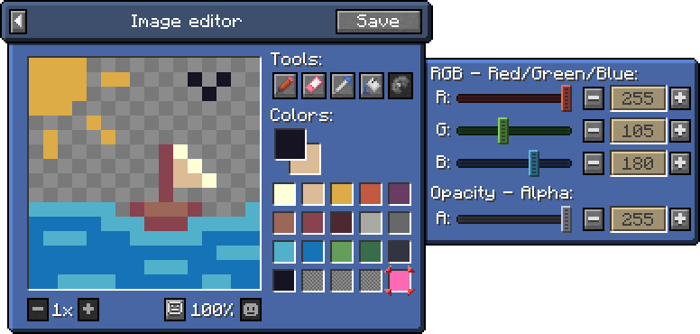

# NibblePoker's Arts & Crafts
Minecraft mod that provides you with the ability to draw on and customise a variety of blocks
and signs for all your building, decoration & role-play needs.

[Mod's Wiki](https://wiki.minecraft.nibblepoker.lu/arts_and_crafts)

[See on Modrinth](#) (TODO) 
[See on CurseForge](#) (TODO)

## Implemented Features

* **STILL IN DEVELOPMENT**

## Planned Features

* Ability to draw custom images
  * Wooden signs 
  * Neon lights
  * ???
* Color-blind friendliness tools
  * Simulate different effects when drawing
* Moderation tools
  * **Entirely optional, it's just nice to have**
  * Server-side authorship attribution for each drawing
  * Ability for OPs to consult all drawings known to server
  * Ability to block/ban certain drawings after application
  * <s>Drawing usage logging</s> (Might come later)
* Neon Tubes
  * Make multi-frame animated signs
* Small & funny interactions
  * Glue can be drunk
  * Neon Tubes can be used as tactical weapons
  * Road signs thieving mechanics

## Mechanics
For detailed information, visit the [Mod's Wiki](https://wiki.minecraft.nibblepoker.lu/arts_and_crafts).

### Neon Tubes&nbsp;&nbsp;[Wiki](https://wiki.minecraft.nibblepoker.lu/arts_and_crafts/neon_tubes)

The *Neon Tubes* are a crafting material that can be also used in combat.

When a foe is smacked with one of these, the tube will break and release a small short-lived poison cloud around your target. 
But be carefull, after doing so, both of you will be able to pickup a sharp and fragile *Broken Neon Tube* piece that can be used
as an impromptu knife.

### Moderation &nbsp;&nbsp;[Wiki](https://wiki.minecraft.nibblepoker.lu/arts_and_crafts/moderation)
This mod provides parents and server owners with a couple of in-game and out-of-game tools that can be used to
overview, manage and moderate the user-created content originating from this mod.

We also **strongly** recommend you read our [Wiki page](https://wiki.minecraft.nibblepoker.lu/arts_and_crafts/moderation)
to get a thorough overview of these tools.

Quick overview

#### How is art stored & handled ?
Every piece of art drawn by players is stored in a [NBT file](https://minecraft.wiki/w/NBT_format)
in the `NibblePokerData/np_arts_and_crafts/` folder of your installation for both the server and the client.

Everytime a player loads a block with a piece of art, it will ask the server to send a copy of it. 
If it can, the server sends it and the client keeps a copy to make subsequent loadings faster.

However, during that process, the server can notify the client that the art piece has been banned and shouldn't
be displayed. 
This allows parents and server owners to block art pieces in a quick and easy way.

*More ways to monitor and force refresh images will be implemented later.*

#### In-game art browser
[TODO: Add quick overview]

#### Art banning
Pieces of art can be banned and unbanned at will by a server operator in-game, or by changing the `banned` NBT
field in a `.art.nbt` file to `0` or `1` and restarting the server.

### Interface & Menus&nbsp;&nbsp;[Wiki](https://wiki.minecraft.nibblepoker.lu/arts_and_crafts/interface)
Most of the mod's menus can be accessed by using the *Designer's Tab* pictured on the right.

#### Image Gallery
TODO

#### Image Details
TODO

#### Image Creator
TODO

#### Image Editor
The image editor allows you to create and modify images easily in-game and provides tou with these tools: 
&nbsp;● Pencil & Eraser 
&nbsp;● Color Picker 
&nbsp;● Bucket Filler 
&nbsp;● Color Editor 
&nbsp;● Color Blindness Filters **(TODO)**

## Source code

### Forge
* [1.20.1](https://github.com/NibblePoker/MC-Arts-And-Crafts/tree/1.20.1-forge) - `1.20.1-forge` branch

### Fabric
Not supported, **might** come later once everything is in place.

## Attributions

### ENDESGA
[**ENDESGA SOFT 16 PALETTE**](https://lospec.com/palette-list/endesga-soft-16)

See on [lospec.com](https://lospec.com/palette-list/endesga-soft-16)

### Nakhas
[**Neon bulb breaking on the ground.wav**](https://freesound.org/people/Nakhas/sounds/360410/) - 
[CC BY-NC 4.0](https://creativecommons.org/licenses/by-nc/4.0/deed.en) 
[**Slurp sounds**](https://freesound.org/people/Nakhas/sounds/569259/) - 
[CC0](https://creativecommons.org/public-domain/cc0/) 
[**Wooshes.wav**](https://freesound.org/people/Nakhas/sounds/328554/) - 
[CC BY-NC 4.0](https://creativecommons.org/licenses/by-nc/4.0/deed.en)

See on [freesound.org](https://freesound.org/people/Nakhas/) or on their [their website](http://nicolas-martigne.info/).

### keng-wai-chane-chick-te
[**LIGHT_NEON_DYSFUNCTION.wav**](https://freesound.org/people/keng-wai-chane-chick-te/sounds/422220/) - 
[CC0](https://creativecommons.org/public-domain/cc0/)

See on [freesound.org](https://freesound.org/people/keng-wai-chane-chick-te/)

### TODO
https://github.com/MaPePeR/jsColorblindSimulator

## License
[Apache V2](LICENSE)
